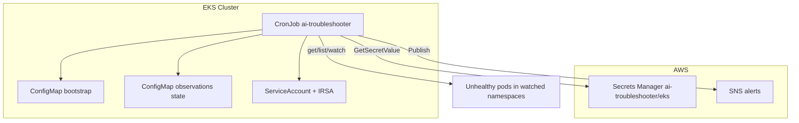
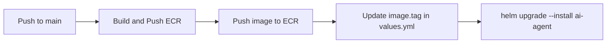

# AI Helm Deployment — K8s AI Agent Chart

This repo deploys the **AI Troubleshooter** to Amazon EKS using Helm. The chart lives in `K8s-ai-agent-helm-chart/` and replaces plain `kubectl apply` manifests with versioned, repeatable Kubernetes deployments.

---

## Why this chart exists

Previously, the AI agent was deployed with individual YAML files (`rbac.yaml`, `configmap.yaml`, `cronjob.yaml`) applied by hand or by a GitHub Actions workflow that ran `kubectl apply` and `sed` to swap the image URI.

That approach has problems:

| Problem with plain manifests | How Helm fixes it |
|------------------------------|-------------------|
| Image tag patched with `sed` at deploy time | `image.tag` in `values.yml` — one field, updated by CI |
| No single source of truth for cluster config | All deploy settings in `values.yml` |
| Hard to diff what will change before apply | `helm diff upgrade` shows exact delta |
| Manifests scattered in the app repo | Deploy config separated from application code |
| No easy rollback | `helm rollback` to previous release |

**Split of responsibilities:**

```
AI-Agent-eks-aiops/          AI-helm-deployment/
├── Python app code           ├── K8s-ai-agent-helm-chart/   ← this chart
├── Dockerfile                │   ├── values.yml
├── config/                   │   └── templates/
│   ├── agents.yaml           └── .github/workflows/
│   ├── tasks.yaml
│   └── protected-resources.yaml
└── Build & Push ECR workflow
```

- **App repo** — builds the Docker image, holds AI agent logic and LLM prompts.
- **Helm repo** — defines *how* the agent runs on EKS (CronJob, RBAC, ConfigMaps, IRSA).

---

## What the agent does on EKS

The chart deploys a **CronJob** that runs every 5 minutes and scans the cluster for unhealthy pods. When a pod stays unhealthy for the **5-minute observation window**, the agent triggers AI-powered diagnosis and sends alerts.



---

## Chart structure

```
K8s-ai-agent-helm-chart/
├── Charts.yml                  # Chart metadata (rename to Chart.yaml for Helm CLI)
├── values.yml                  # All configurable deploy settings
├── irsa-policy.example.json    # IAM policy for pod → Secrets Manager + SNS
├── trust-policy.json           # IRSA trust policy example (OIDC → ServiceAccount)
└── templates/
    ├── namespace.yml           # platform-agents namespace
    ├── serviceaccount.yml      # ai-troubleshooter SA with IRSA annotation
    ├── configmap.yml           # Bootstrap env (non-secret)
    ├── observations-configmap.yml  # Observation window state (first_seen timestamps)
    ├── cronjob.yml             # Main troubleshooter workload
    ├── Cluster-role.yml        # Read-only cluster scan permissions
    ├── Cluster-role-binding.yml
    ├── role.yml                # Write access to observations ConfigMap only
    └── role-binding.yml
```

---

## Each component — why, what, how

### 1. Namespace (`templates/namespace.yml`)

| | |
|---|---|
| **Why** | Isolates the AI agent from application workloads. |
| **What** | Creates `platform-agents` namespace. |
| **How** | `helm upgrade --install` with `--create-namespace` or this template. |

---

### 2. ServiceAccount + IRSA (`templates/serviceaccount.yml`)

| | |
|---|---|
| **Why** | The pod needs AWS access without storing access keys. IRSA (IAM Roles for Service Accounts) gives the pod a temporary AWS credential via OIDC. |
| **What** | ServiceAccount `ai-troubleshooter` annotated with `eks.amazonaws.com/role-arn`. |
| **How** | EKS OIDC provider trusts only `system:serviceaccount:platform-agents:ai-troubleshooter`. The IAM role policy (`irsa-policy.example.json`) allows: |

- `secretsmanager:GetSecretValue` on `ai-troubleshooter/eks` — API keys, LLM keys, SNS topic, watched namespaces
- `sns:Publish` on alert topic — incident notifications

**One-time IAM setup** (before first Helm install):

```bash
# Create IAM policy from example
aws iam create-policy \
  --policy-name ai-troubleshooter-eks-policy \
  --policy-document file://K8s-ai-agent-helm-chart/irsa-policy.example.json

# Create role with trust policy (update OIDC provider ID for your cluster)
aws iam create-role \
  --role-name ai-troubleshooter-eks \
  --assume-role-policy-document file://K8s-ai-agent-helm-chart/trust-policy.json

aws iam attach-role-policy \
  --role-name ai-troubleshooter-eks \
  --policy-arn arn:aws:iam::018701995398:policy/ai-troubleshooter-eks-policy
```

---

### 3. Bootstrap ConfigMap (`templates/configmap.yml`)

| | |
|---|---|
| **Why** | Tells the pod *where* to fetch secrets — without putting secrets in Kubernetes. |
| **What** | Non-secret env vars injected via `envFrom`: |

| Key | Purpose |
|-----|---------|
| `AWS_SECRETS_MANAGER_SECRET_NAME` | Secret name in AWS (`ai-troubleshooter/eks`) |
| `AWS_REGION` | AWS region for Secrets Manager |
| `RUN_MODE` | `scan` — periodic cluster scan (CronJob mode) |
| `ATLASSIAN_USE_OAUTH` | `false` on EKS (use API token from SM) |
| `LOG_LEVEL` | Logging verbosity |

| **How** | At startup, the Python app reads this ConfigMap, then calls Secrets Manager via IRSA to load `OPENAI_API_KEY`, `ANTHROPIC_API_KEY`, `WATCHED_NAMESPACES`, `OBSERVATION_WINDOW_SECONDS`, etc. |

**Important:** API keys and sensitive config live in **AWS Secrets Manager**, not in Helm values or git.

---

### 4. Observations ConfigMap (`templates/observations-configmap.yml`)

| | |
|---|---|
| **Why** | The CronJob pod is short-lived (runs, exits). The 5-minute observation window must survive across runs. |
| **What** | ConfigMap `ai-troubleshooter-observations` stores `state.json` with `first_seen` timestamps for unhealthy pods. |
| **How** | On each scan, the agent reads/updates this ConfigMap. If a pod has been unhealthy for ≥ 300 seconds, diagnosis triggers. Transient blips that recover within 5 minutes are ignored. |

---

### 5. CronJob (`templates/cronjob.yml`)

| | |
|---|---|
| **Why** | Runs the troubleshooter on a schedule without a always-on Deployment. |
| **What** | CronJob `ai-troubleshooter` — every 5 minutes, spawns a Job pod that runs `run-diagnostics`. |
| **How** | Key settings from `values.yml`: |

| Setting | Value | Reason |
|---------|-------|--------|
| `schedule` | `*/5 * * * *` | Aligns with 300s observation window |
| `concurrencyPolicy` | `Forbid` | No overlapping scans |
| `backoffLimit` | `0` | Fail fast, don't retry silently |
| `activeDeadlineSeconds` | `900` | Kill stuck jobs after 15 min |
| `image.tag` | Updated by CI | Points to latest ECR build |

---

### 6. RBAC (`templates/Cluster-role*.yml`, `templates/role*.yml`)

| | |
|---|---|
| **Why** | The agent reads cluster state but must never modify workloads. Only the observations ConfigMap is writable. |
| **What** | Two permission layers: |

**ClusterRole `ai-troubleshooter-readonly`** (read-only):
- Pods, pod logs, events, services, namespaces
- ConfigMaps (metadata only — not Secret values)
- PVCs, Deployments, StatefulSets, ReplicaSets, HPAs

**Role `ai-troubleshooter-observations`** (namespace-scoped write):
- `get`, `update`, `patch` on ConfigMap `ai-troubleshooter-observations` only
- `create` for first-time state initialization

| **How** | Bound to ServiceAccount `ai-troubleshooter`. The agent never gets `create/update/delete` on Deployments, Pods, or Secrets. |

---

## `values.yml` reference

All deploy-time settings. Edit this file or override at install time with `--set`.

```yaml
namespace: platform-agents

image:
  repository: 018701995398.dkr.ecr.ap-south-1.amazonaws.com/ai-troubleshooter-eks
  tag: "latest"          # ← updated by CI after Build and Push ECR
  pullPolicy: Always

cronjob:
  enabled: true
  schedule: "*/5 * * * *"
  # ... resources, env, securityContext

config:
  awsSecretsManagerSecretName: "ai-troubleshooter/eks"
  awsRegion: "ap-south-1"
  runMode: "scan"

observations:
  enabled: true
  name: ai-troubleshooter-observations

serviceAccount:
  annotations:
    eks.amazonaws.com/role-arn: "arn:aws:iam::018701995398:role/ai-troubleshooter-eks"

rbac:
  create: true
```

### What is NOT in `values.yml` (by design)

| Config | Where it lives | Why |
|--------|----------------|-----|
| API keys (OpenAI, Anthropic) | AWS Secrets Manager | Never in git or K8s |
| `agents.yaml`, `tasks.yaml` | Docker image (`AI-Agent-eks-aiops/config/`) | App logic, changes with code |
| `protected-resources.yaml` | Docker image | LLM safety rules — baked in at build |
| `WATCHED_NAMESPACES`, `OBSERVATION_WINDOW_SECONDS` | AWS Secrets Manager | Runtime config, no rebuild needed |

---

## How to deploy

### Prerequisites

1. EKS cluster running (`eks-dev-eks`)
2. IRSA role `ai-troubleshooter-eks` created (see IAM setup above)
3. AWS Secrets Manager secret `ai-troubleshooter/eks` populated with app keys
4. Docker image pushed to ECR (`ai-troubleshooter-eks` repo)
5. `kubectl` configured for the cluster
6. Helm 3 installed

### Manual deploy

```bash
cd AI-helm-deployment

# Lint
helm lint K8s-ai-agent-helm-chart/ -f K8s-ai-agent-helm-chart/values.yml

# Preview rendered manifests
helm template ai-agent K8s-ai-agent-helm-chart/ \
  -f K8s-ai-agent-helm-chart/values.yml

# Install or upgrade
helm upgrade --install ai-agent K8s-ai-agent-helm-chart/ \
  -f K8s-ai-agent-helm-chart/values.yml \
  --namespace platform-agents \
  --create-namespace \
  --set image.tag=<git-sha>

# Verify
kubectl -n platform-agents get cronjob,sa,configmap
kubectl -n platform-agents get cronjob ai-troubleshooter
```

### CI/CD deploy (recommended)



1. **App repo** (`AI-Agent-eks-aiops`) — **Build and Push ECR** workflow builds the image and sets `LATEST_ECR_IMAGE_TAG`.
2. **Deploy workflow** patches `K8s-ai-agent-helm-chart/values.yml` → `image.tag` and runs `helm upgrade`.

Update tag without editing the file:

```bash
helm upgrade --install ai-agent K8s-ai-agent-helm-chart/ \
  -f K8s-ai-agent-helm-chart/values.yml \
  --namespace platform-agents \
  --set image.tag=abc1234
```

---

## Verify it works

```bash
# CronJob exists
kubectl -n platform-agents get cronjob ai-troubleshooter

# Trigger a manual scan
kubectl -n platform-agents create job \
  --from=cronjob/ai-troubleshooter manual-test-$(date +%s)

# Watch job logs
kubectl -n platform-agents logs -l app=ai-troubleshooter --tail=200

# Check observation state
kubectl -n platform-agents get configmap ai-troubleshooter-observations -o yaml
```

To test failure detection, deploy broken workloads using the separate **`ai-agent-test-chart/`** (not part of this chart).

---

## Rollback and cleanup

```bash
# Rollback to previous Helm release
helm rollback ai-agent -n platform-agents

# Uninstall completely
helm uninstall ai-agent -n platform-agents

# List release history
helm history ai-agent -n platform-agents
```

RBAC ClusterRoles and the namespace may remain after uninstall. Delete manually if needed:

```bash
kubectl delete clusterrole,clusterrolebinding -l app=ai-troubleshooter-readonly
kubectl delete namespace platform-agents
```

---

## Troubleshooting

| Symptom | Likely cause | Fix |
|---------|--------------|-----|
| Pod `CrashLoopBackOff` — missing API keys | Secrets Manager empty or IRSA misconfigured | Check SM secret; verify SA annotation and IAM policy |
| `AccessDenied` on Secrets Manager | IRSA role missing `GetSecretValue` | Attach `irsa-policy.example.json` to role |
| No pods detected | `WATCHED_NAMESPACES` in SM doesn't include target namespace | Update SM secret |
| Diagnosis never triggers | Observation window not elapsed (5 min) | Wait; check `ai-troubleshooter-observations` ConfigMap |
| Image pull error | Wrong `image.tag` or ECR repo | Re-run Build and Push ECR; update tag |
| `helm lint` fails | `Charts.yml` should be `Chart.yaml` | Rename file |

---

## Related repos and charts

| Resource | Location |
|----------|----------|
| Application source code | `AI-Agent-eks-aiops/` |
| Build workflow | `AI-Agent-eks-aiops/.github/workflows/build-push.yml` |
| Test failure scenarios | `AI-helm-deployment/ai-agent-test-chart/` |
| Pipeline docs | `AI-Agent-eks-aiops/.github/PIPELINES.md` |

---

## Security summary

- No AWS access keys in git or Kubernetes Secrets
- App secrets in AWS Secrets Manager only
- Pod has read-only Kubernetes access (except observations ConfigMap)
- IRSA scoped to one ServiceAccount in one namespace
- GitHub Actions uses OIDC — no long-lived credentials

See `AI-Agent-eks-aiops/SECURITY.md` for the full security model.
